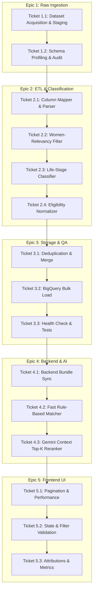

# Yojana Dvar — Dataset Expansion: Epics & Tickets
**Dataset Source:** [Kaggle: Indian Government Schemes (`jainamgada45/indian-government-schemes`)](https://www.kaggle.com/datasets/jainamgada45/indian-government-schemes/data)  
**Objective:** Scale Yojana Dvar's catalog from initial sample schemes to 150–300+ women and girl-child welfare schemes across all 28 Indian States & 8 UTs.

---

## 1. Epics & Milestones Overview

| Epic ID | Title | Objective | Target Delivery |
| :--- | :--- | :--- | :--- |
| **Epic 1** | **Dataset Acquisition & Raw Staging** | Download, profile, and stage the raw MyScheme scraped CSV dataset. | Day 1 |
| **Epic 2** | **ETL Pipeline & Intelligent Women-Centric Classification** | Implement column parsing, women-relevancy filtering, life-stage tagging, and eligibility constraint extraction. | Day 2 |
| **Epic 3** | **Data Warehouse Ingestion & Quality Assurance** | Deduplicate records, validate schemas, and bulk-load into BigQuery `schemes_women`. | Day 2–3 |
| **Epic 4** | **Backend Matcher & AI Context Optimization** | Update in-memory matcher cache, optimize vector search, and adjust Gemini AI context limits for 300+ schemes. | Day 3 |
| **Epic 5** | **Frontend UI Scalability & Catalog Experience** | Verify search performance, state/category filtering, pagination, and update data attribution. | Day 4 |

---

## 2. Detailed Epic & Ticket Breakdown



---

### Epic 1: Dataset Acquisition & Raw Staging

#### Ticket 1.1: Kaggle Dataset Source Acquisition & Local/GCS Staging
- **Scope:** Fetch `updated_data.csv` (or full CSV dumps) from `jainamgada45/indian-government-schemes` and stage under local and cloud storage.
- **Tasks:**
  - Create raw storage path `data/raw/kaggle_myscheme_schemes.csv`.
  - Update [`scripts/stage_raw_datasets.py`](file:///Users/kirtikaj/workspace/yojanadvar/yojana-dvar/scripts/stage_raw_datasets.py) to support downloading/loading Kaggle MyScheme dataset via Kaggle API or direct CSV ingestion.
  - Upload raw source file to Google Cloud Storage (`gs://yojana-dvar-raw/kaggle_myscheme_schemes.csv`).
- **Acceptance Criteria:**
  - `data/raw/kaggle_myscheme_schemes.csv` is present on disk and staged in GCS bucket.

#### Ticket 1.2: Raw Dataset Schema Profiling & Data Quality Audit
- **Scope:** Inspect and profile raw columns, missing values, delimiters, and data distribution across central vs. state schemes.
- **Tasks:**
  - Script a data profiling report checking column nullability, unique ministries, and state distributions.
  - Document column mappings between Kaggle CSV headers and Yojana Dvar BigQuery schema (`schemes_women`).
- **Acceptance Criteria:**
  - A schema profiling summary verifying the total number of raw scheme records and column completeness.

---

### Epic 2: Intelligent ETL Pipeline & Women-Centric Classification

#### Ticket 2.1: Custom Column Mapper & Parser (`transform_kaggle_myscheme_record`)
- **Scope:** Build transformer logic in [`scripts/etl_load_schemes.py`](file:///Users/kirtikaj/workspace/yojanadvar/yojana-dvar/scripts/etl_load_schemes.py) to parse Kaggle MyScheme CSV records into the standard `schemes_women` data model.
- **Tasks:**
  - Map core fields: `scheme_name`, `ministry_name`, `department_name`, `state_name`, `scheme_category`, `scheme_benefits`, `required_documents`, `application_process`, and `apply_url`.
  - Generate clean unique slugs (`scheme_id`) using sanitized English naming.
- **Acceptance Criteria:**
  - Transformer cleanly parses raw records without runtime errors.

#### Ticket 2.2: Multi-Criteria Women & Girl-Child Relevancy Classifier
- **Scope:** Implement filtering heuristics to isolate schemes targeted at women, girl children, mothers, widows, and female-led households.
- **Tasks:**
  - Add explicit gender check (`gender == 'Female' | 'All'`).
  - Add expanded keyword & Hindi/Devanagari/Transliterated matching:
    - *Keywords:* `women`, `woman`, `girl`, `mahila`, `matru`, `sukanya`, `widow`, `vidhwa`, `kanya`, `ladli`, `maternal`, `mother`, `nari`, `balika`, `pregnant`, `lactating`, `shg`, `self-help group`, `anganwadi`, `asha`.
  - Filter out schemes that are strictly male-targeted or irrelevant.
- **Acceptance Criteria:**
  - Filter produces ~150–300+ high-relevance women-centric welfare schemes with zero false exclusions on known key programs.

#### Ticket 2.3: Life-Stage Classifier & Automated Tagging
- **Scope:** Categorize each scheme into one of the 5 canonical life-stage tags: `maternal`, `student`, `entrepreneur`, `senior`, or `general`.
- **Tasks:**
  - Implement heuristic classifier:
    - **Maternal:** Pregnancy, infant nutrition, lactation, PMMVY, JSY.
    - **Student:** Scholarships, girl-child education, SSY, hostels, STEM grants.
    - **Entrepreneur:** Stand-Up India, Mudra for women, SHG bank linkage, trade subsidies.
    - **Senior:** Widow pensions, elderly women security, old-age assistance.
    - **General:** Housing, sanitation, health insurance, legal aid.
  - Serialize tags into JSON array string: `["maternal", "general"]`.
- **Acceptance Criteria:**
  - 100% of processed schemes have at least one valid life-stage tag assigned.

#### Ticket 2.4: Eligibility Constraint Normalizer (Regex-based Extraction)
- **Scope:** Extract structured eligibility constraints from semi-structured narrative text.
- **Tasks:**
  - Extract numeric age bounds (`age_min`, `age_max`) using regex (e.g. *"aged between 18 and 50 years"* -> `min: 18, max: 50`).
  - Extract income caps (`income_max`) in INR (e.g. *"annual income below Rs 2,50,000"* -> `250000`).
  - Extract social categories (`caste_categories` -> `["SC", "ST", "OBC", "General"]`).
  - Extract boolean flags: `requires_bpl`, `requires_disability`, `is_active`.
- **Acceptance Criteria:**
  - Age and income fields populated with valid integers; boolean flags correctly parsed.

---

### Epic 3: Data Warehouse Ingestion & Quality Assurance

#### Ticket 3.1: Record Deduplication, Conflict Resolution & Catalog Merging
- **Scope:** Merge the new Kaggle-derived catalog with existing curated schemes without losing manually verified data.
- **Tasks:**
  - Implement merge hierarchy: prefer higher-detail descriptions and verified official URLs when conflicts occur on `scheme_id`.
  - Export final unified dataset to:
    - `data/processed/schemes_women.json`
    - `data/processed/schemes_women.csv`
- **Acceptance Criteria:**
  - Deduplicated dataset exported cleanly in both JSON and CSV formats.

#### Ticket 3.2: BigQuery `schemes_women` Bulk Ingestion
- **Scope:** Ingest the expanded dataset into BigQuery table `yojana_dvar.schemes_women`.
- **Tasks:**
  - Execute [`scripts/load_bigquery.py`](file:///Users/kirtikaj/workspace/yojanadvar/yojana-dvar/scripts/load_bigquery.py) to overwrite/insert updated records into BigQuery.
  - Verify schema conformance against [`scripts/schema_schemes_women.sql`](file:///Users/kirtikaj/workspace/yojanadvar/yojana-dvar/scripts/schema_schemes_women.sql).
- **Acceptance Criteria:**
  - BigQuery query `SELECT COUNT(*) FROM yojana_dvar.schemes_women` returns full expanded scheme count.

#### Ticket 3.3: Data Validation & Integration Test Suite
- **Scope:** Run automated checks and integration unit tests on the processed dataset.
- **Tasks:**
  - Write test in `backend/tests/test_dataset_integrity.py` verifying:
    - No empty `name`, `category`, `eligibility_text`, or `benefits`.
    - Valid URL formats on `apply_url` and `official_url`.
    - Realistic integer bounds on `age_min` (0–100) and `age_max` (0–120).
- **Acceptance Criteria:**
  - All test assertions pass with 100% compliance.

---

### Epic 4: Backend Matcher & AI Context Optimization

#### Ticket 4.1: Synchronize Backend Processed Catalog Cache
- **Scope:** Update the local scheme bundle used by FastAPI in development and containerized Cloud Run deployments.
- **Tasks:**
  - Sync `data/processed/schemes_women.json` to `backend/data/processed/schemes_women.json`.
  - Ensure Dockerfile / Cloud Run deployment script automatically bundles the updated file.
- **Acceptance Criteria:**
  - Backend API endpoint `/api/v1/schemes` returns the full expanded catalog.

#### Ticket 4.2: Fast Rule-Based Matcher Verification at Scale
- **Scope:** Validate matcher performance when filtering 300+ schemes based on citizen demographic inputs (Age, State, Caste, Income, Occupation, Marital Status).
- **Tasks:**
  - Benchmark [`backend/app/services/matcher.py`](file:///Users/kirtikaj/workspace/yojanadvar/yojana-dvar/backend/app/services/matcher.py) execution latency (< 50ms for 300+ schemes).
  - Verify that state-specific schemes (e.g. Maharashtra, Tamil Nadu, Uttar Pradesh, Rajasthan) filter correctly when a citizen selects their state.
- **Acceptance Criteria:**
  - Matcher returns accurate matching schemes within < 50ms response time.

#### Ticket 4.3: Gemini Context Top-K Reranking & Token Optimization
- **Scope:** Ensure Gemini AI explanation engine remains within token budget and latency limits with 300+ available schemes.
- **Tasks:**
  - Update [`backend/app/services/gemini.py`](file:///Users/kirtikaj/workspace/yojanadvar/yojana-dvar/backend/app/services/gemini.py) to pass Top-K (e.g. top 5–10 most relevant eligible schemes) to Gemini prompt instead of raw unranked lists.
  - Maintain response formatting in English and Hindi.
- **Acceptance Criteria:**
  - AI eligibility summary and multilingual explanation generated in < 2 seconds.

---

### Epic 5: Frontend UI Scalability & Catalog Experience

#### Ticket 5.1: Scheme Catalog Pagination & UI Virtualization
- **Scope:** Ensure [`frontend/src/pages/Schemes.tsx`](file:///Users/kirtikaj/workspace/yojanadvar/yojana-dvar/frontend/src/pages/Schemes.tsx) renders smoothly with hundreds of schemes.
- **Tasks:**
  - Add client-side pagination (e.g. 12 schemes per page) or infinite scrolling.
  - Optimize scheme card rendering and search input debouncing.
- **Acceptance Criteria:**
  - Scheme list scrolls and searches smoothly with zero frame drops or lag.

#### Ticket 5.2: State-wise & Category-wise Filter Enhancements
- **Scope:** Ensure the state dropdown and horizontal category filter bar reflect all newly available states and categories.
- **Tasks:**
  - Update state options list in UI to cover all 28 States and 8 UTs.
  - Ensure category counts update dynamically based on selected filters.
- **Acceptance Criteria:**
  - Selecting any state displays all matching Central + State-specific schemes.

#### Ticket 5.3: Catalog Statistics & UI Attribution Update
- **Scope:** Update scheme count badges, statistics counters, and dataset attributions.
- **Tasks:**
  - Update scheme statistics counter on homepage hero section.
  - Update data source attributions on [About page](file:///Users/kirtikaj/workspace/yojanadvar/yojana-dvar/frontend/src/pages/About.tsx) to credit MyScheme / Kaggle `jainamgada45/indian-government-schemes`.
- **Acceptance Criteria:**
  - UI displays accurate scheme counts and transparent data sourcing.

---

## 3. Implementation Checklist & Verification

```markdown
- [x] Ticket 1.1: Download & stage raw Kaggle CSV to data/raw/
- [x] Ticket 1.2: Schema profile & audit
- [ ] Ticket 2.1: Implement Kaggle record parser in scripts/etl_load_schemes.py
- [ ] Ticket 2.2: Implement Women-relevancy filter logic
- [ ] Ticket 2.3: Implement life-stage classifier & tagging
- [ ] Ticket 2.4: Implement eligibility constraints normalizer
- [ ] Ticket 3.1: Deduplicate & export data/processed/schemes_women.json
- [ ] Ticket 3.2: Load into BigQuery schemes_women table
- [ ] Ticket 3.3: Run dataset integrity tests
- [ ] Ticket 4.1: Sync backend local cache
- [ ] Ticket 4.2: Verify matcher response time (< 50ms)
- [ ] Ticket 4.3: Validate Gemini Top-K AI explanation
- [ ] Ticket 5.1: Verify frontend pagination & rendering performance
- [ ] Ticket 5.2: Verify 28 States & 8 UTs filtering
- [ ] Ticket 5.3: Update homepage stats & data attribution
```
